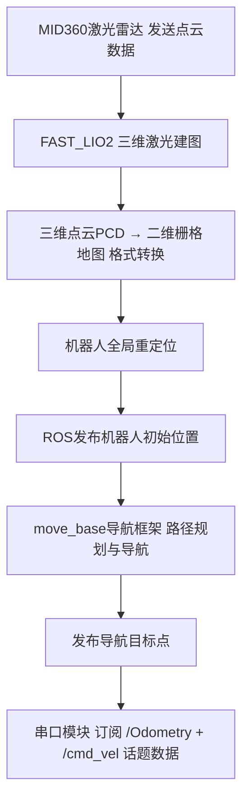

# ROBOCON-BRS_robot｜黑岩射手（BRS）

ROBOCON 作为机器人领域的顶尖赛事，对机械可靠性、电控稳定性、视觉/感知准确性提出了很高的要求。

本仓库为 2025 赛季足式机器人（一队）项目的开源整理，涵盖机械建模、运动/力控制，以及基于 3D LiDAR 的建图定位与自主导航。

在 2025 赛季我基本完整负责了足式机器人一队从机械建模、运动控制到自主导航的全栈研发，采用类植保无人机碳管装配工艺机构 + 力控制算法 + 3D 雷达建图导航技术，取得了较好的比赛成绩。

## 2025 成绩
- 2025 ROBOCON（江阴）足式机器人（180+ 队伍）：竞速赛全国第 30 名、障碍赛全国第 31 名、越野赛全国第 34 名
- 三项均获全国二等奖（国二）

## 技术要点
- 类植保无人机的碳纤管装配式机身工艺与结构设计
- 运动控制与力控制
- 3D LiDAR（Livox Mid-360）建图定位与导航（ROS1 / `move_base`）
- 主从架构：上位机（ROS）↔ 下位机（STM32F427，串口通信）

## 演示

  
  
MATLAB：轨迹可视化与逆解算演示

  

  

## 系统架构

  
  
系统架构图

## 标定模式数据读取

  
  
校准/标定模式的数据读取演示

## 仓库结构
| 目录 | 说明 |
| --- | --- |
| `1.Hardware/` | 机械结构（SolidWorks 零件/装配）与电控工程文件（`.epro`） |
| `2.Software/Host/` | 上位机（ROS：SLAM/定位/导航/通信等），详见 [`2.Software/Host/README_CN.md`](./2.Software/Host/README_CN.md) |
| `2.Software/Slave/` | 下位机（STM32F427，Keil uVision 工程：[`Lain_Iwakura.uvprojx`](<./2.Software/Slave/project/RVMDK(V5)/Lain_Iwakura.uvprojx>)) |
| `3.Document/` | 模块资料与手册（PDF） |
| `4.Picture/` | 比赛视频（mp4） |
| `assets/` | README 图片素材 |

## 快速开始（从这里看）
- 上位机（ROS）：阅读 [`2.Software/Host/README_CN.md`](./2.Software/Host/README_CN.md)
- 下位机（Keil）：打开 [`2.Software/Slave/project/RVMDK(V5)/Lain_Iwakura.uvprojx`](<./2.Software/Slave/project/RVMDK(V5)/Lain_Iwakura.uvprojx>)
- 机械模型（SolidWorks）：打开 [`1.Hardware/models/总装配.SLDASM`](./1.Hardware/models/%E6%80%BB%E8%A3%85%E9%85%8D.SLDASM)

## 项目时间线
| 时间 | 里程碑 |
| --- | --- |
| 2024-08 | 项目启动 |
| 2024-12 | 完成第一版机械实物 |
| 2025-02 | 完成第一版下位机 |
| 2025-04 | 完成上位机 |
| 2025-06 | 完成导航功能 |
| 2025-07 | 完成第二版下位机，并参赛 |

## 更新记录
| 时间 | 内容 |
| --- | --- |
| 2025-11 | 开源机械结构 |
| 2025-12 | 开源下位机控制软件 |

## 致谢
- 上位机导航系统参考：`NEXTE_Sentry_Nav`（66Lau）等开源工作：<https://github.com/66Lau/NEXTE_Sentry_Nav>
- 参考教程：
  - <https://blog.csdn.net/weixin_52612260/article/details/134124028>
  - <https://blog.csdn.net/Hbutneymar/article/details/147161479>

## 许可
本仓库当前未附带 `LICENSE` 文件；如需在论文/商业项目中使用，请先联系作者确认授权范围。
